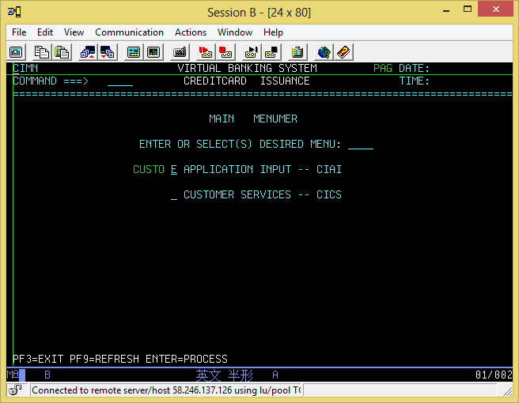
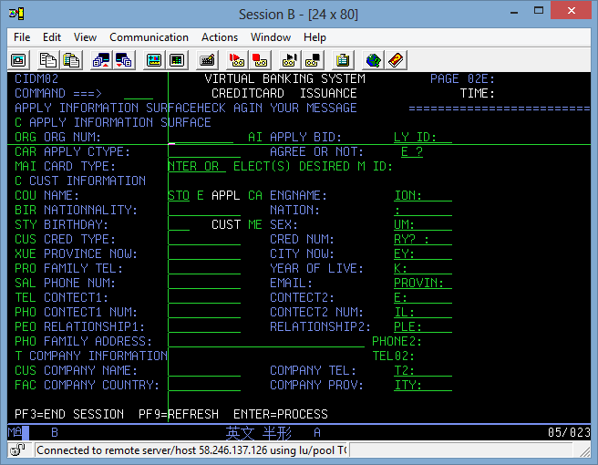

# VirtualBank
##Virtual credit card Bank based on IBM MainFrame and download codes from MF as below structure
- ...CPY means fields layout and attribute 
- ...SRC means main business logic
- ...JCL means job to process business  
- ...MAP means Virtual credit Bank panel
- ...Dco folder means for some design doc
- ...img folder means for some some screenshot  

## screenshot

